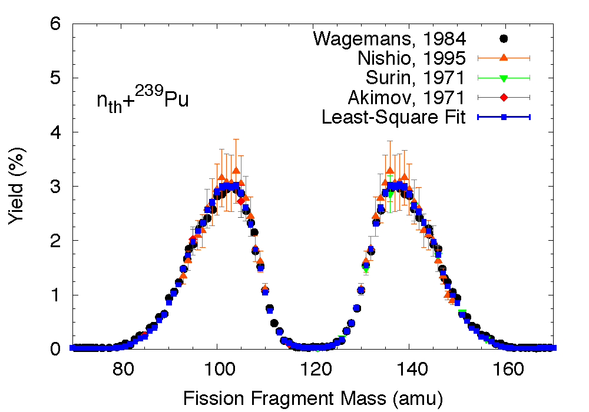
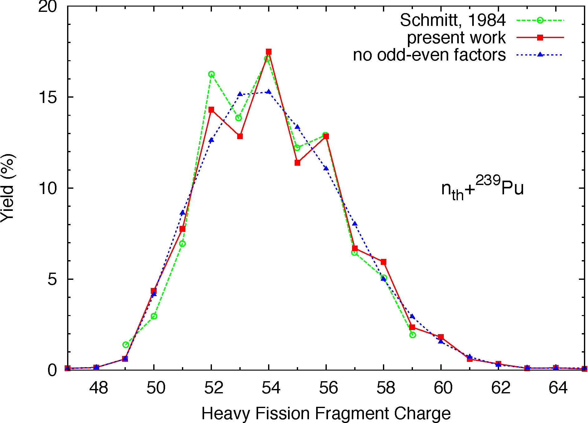
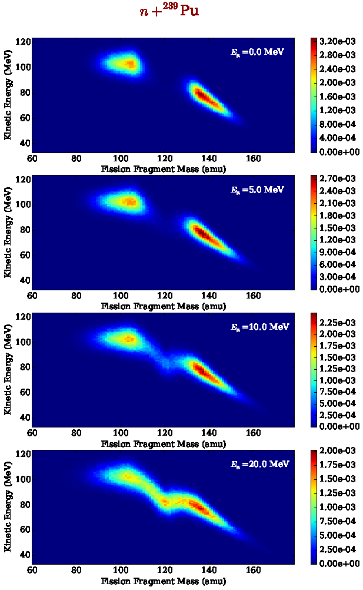
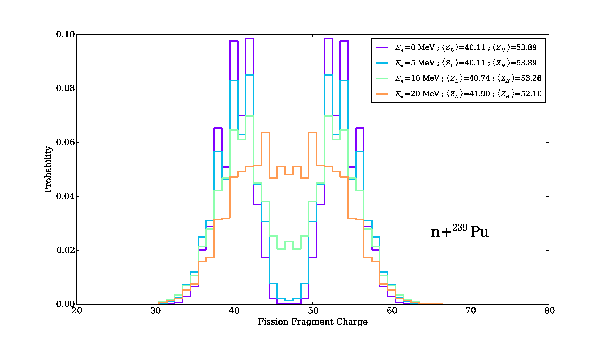
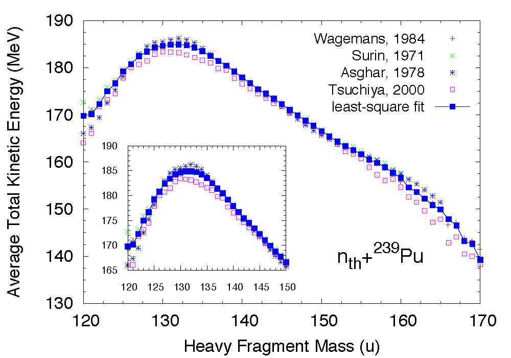
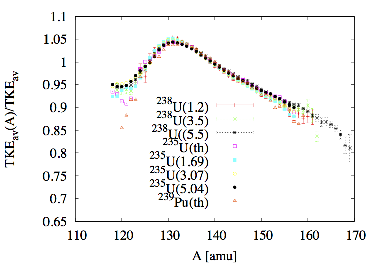
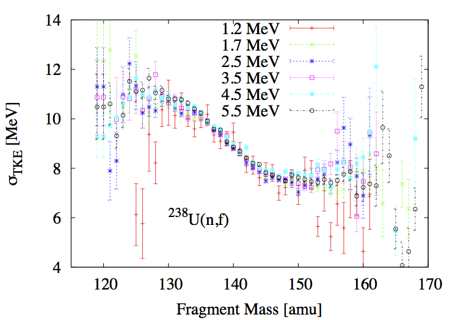
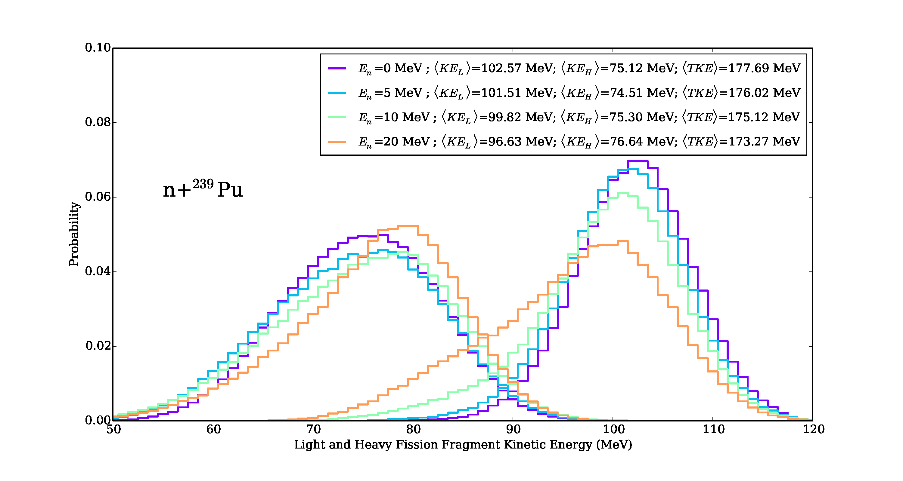
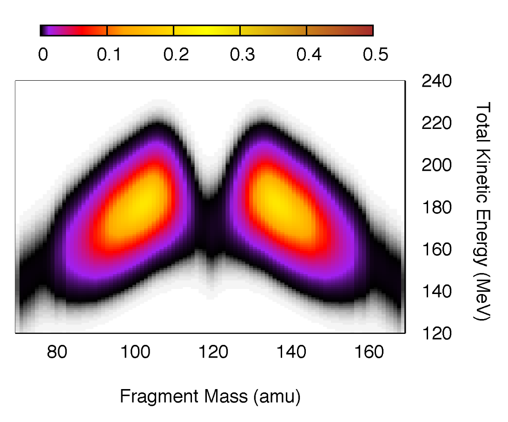

Fission Fragment Yields
=======================

:program:`CGMF` does not calculate the initial pre-neutron fission fragment yields. Instead, it reads or reconstructs those yields in mass, charge and kinetic energy, :math:`Y(A,Z,TKE)`, from experimental data or systematics. Several theoretical efforts are underway to predict fission fragment yields from dynamical fission calculations. We will incorporate the results of those works as they become available.

In the present version of :program:`CGMF`, only binary fission events are considered. Ternary fission where an alpha-particle is emitted along with the two fragments is not treated, nor more complicated "fission" splitting, e.g., accompanied with cluster emission. In addition, the neutron emission is assumed to happen only once both fragments are `fully accelerated`. In other words, no `scission` neutrons are considered at this point. However, multi-chance fission processes such as (:math:`n,n'f`), (:math:`n,2nf`), etc., as well as pre-equilibrium contributions are taken into account at higher incident energies.

Mass Yields
-----------

Thermal Neutrons and Spontaneous Fission
++++++++++++++++++++++++++++++++++++++++

For important fission reactions such as the thermal neutron-induced fission cross-section of Pu-239 and U-235, enough reliable experimental data exist to reconstruct those initial yields reasonably well. This was done for instance in the case of thermal neutron-induced fission on Pu-239 in `[Talou, 2011] <http://journals.aps.org/prc/abstract/10.1103/PhysRevC.83.064612>`_. In that case, the fission fragment mass distribution :math:`Y(A)` was obtained from a least-square fit of several experimental data sets, as shown in Fig. MassYields_.

.. _MassYields:

	
Primary fission fragment mass (top) and charge (bottom) yields for thermal neutron-induced fission of Pu-239. Experimental data on the mass yields were used in a least-square fit to produce the black line. The charge distribution was reconstructed following the Wahl systematics for each fragment mass, as explained below.

Incident Neutron Energies up to 20 MeV
++++++++++++++++++++++++++++++++++++++

At higher incident neutron energies, experimental data become scarce or non-existent, and one has to rely on theoretical models to construct the fragment yields. In the version 1.0.6 of the code, we have implemented a simplified energy dependence for the mass yields. It consists in using a three Gaussian model, whose parameters have been adjusted to reproduce experimental data, when available. For a particular incident neutron energy :math:`E_n`, the yield for the fragment mass :math:`A` is given by:

.. math::

	Y(A;E_n) = G_0(A)+G_1(A)+G_2(A),

where :math:`G_0` corresponds to a symmetric mode,

.. math::

	G_0(A)=\frac{W_0}{\sigma_0\sqrt{2\pi}}\mbox{exp}\left(-\frac{(A-\overline{A})^2}{2\sigma_0^2}\right),

and :math:`G_1` and :math:`G_2` to two asymmetric modes

.. math::

	G_{1,2}(A) = \frac{W_{1,2}}{\sigma_{1,2}\sqrt{2\pi}} \left[ \mbox{exp}\left(-\frac{(A-\overline{A}-D_{1,2})^2}{2\sigma_{1,2}^2}\right) + \mbox{exp}\left(-\frac{(A-\overline{A}+D_{1,2})^2}{2\sigma_{1,2}^2}\right) \right].

Here, :math:`\overline{A}=A_f/2` with :math:`A_f` the mass of the fissioning system, which can differ from the original compound nucleus if pre-fission neutrons are emitted. The parameters :math:`D_i` are governed by spherical and deformed shell closures. Their values decrease by 1/2 for each pre-fission neutron emitted. The energy-dependence for the width parameters is given by:

.. math::

	\sigma_i = \sigma_i^{(0)}+\sigma_i^{(1)}E_n+\sigma_i^{(2)}E_n^2

for :math:`i=1,2`. The width of the symmetric mode :math:`\sigma_0` is assumed to be energy independent.

The weights :math:`W_i` of the Gaussians depend slowly on the incident energy, with an increasing symmetric component. For :math:`W_{1,2}`, we adopt the following energy dependence:

.. math::

	W_i = \frac{W_i^0}{1+\mbox{exp}[(E_n-E_1)/E_2]},

with two adjustable parameters :math:`E_{1,2}`. The weight :math:`W_0` for the symmetric mode is obtained through the normalization condition

.. math::

	W_0 + W_1 + W_2 = 2.

.. _fig_YAKE-Einc:

    Fission fragment yields as a function of mass and kinetic energy, for several incident neutron energies in the neutron-induced fission reaction on Pu-239. Multi-chance fission and pre-equilibrium contributions are taken into account as the incident neutron energy increases.

If neutrons are emitted prior to fission, the fissioning nucleus is formed with a residual excitation energy smaller than the initial excitation energy. In this case, an "equivalent" incident neutron energy is defined as the neutron energy that would produce the :math:`(A_0-\nu_{pre})` fissioning nucleus, with :math:`\nu_{pre}` pre-fission neutrons, at the same residual excitation energy. Hence, :math:`E_n` becomes

.. math::

	E_n = E^*-S_{n|A_0-\nu_{pre}}.

The same equivalent incident energy is used in the Wahl parameterization for the charge distribution.

In the current version of the code, we impose that :math:`E^*` be greater or equal than the fission barrier height in the :math:`(A_0-\nu_{pre})` nucleus, and therefore neglect any subbarrier fission events.

.. note::

	Initial parameterizations for the three-Gaussian model were taken from the :program:`FREYA` code. Newer parameterizations based on better fits to known experimental data are being investigated.

Charge Yields
-------------

Wahl systematics `(Wahl, 2002) <https://www.osti.gov/servlets/purl/809574-GOX0S1/native/>`_ are then used to obtain the charge distribution for a given mass following:

.. math::
   :label: YZA

	P(Z|A) = \frac{1}{2}F(A)N(A)\left[ erf(V)-erf(W) \right],

where

.. math::
	V = \frac{Z-Z_p+0.5}{\sigma_z\sqrt(2)} \mbox{ and } W=\frac{Z-Z_p-0.5}{\sigma_z\sqrt(2)}

and :math:`erf(x)` represents the error function. The factor :math:`N(A)` is simply a normalization factor. The most probable charge is given by

.. math::
   :label: Zp

	Z_p=A_h\frac{Z_c}{A_c}+\Delta Z,

where :math:`Z_c,A_c` are the charge and mass of the fissioning compound nucleus, :math:`\sigma_z` is the charge width parameter and :math:`\Delta Z` is the charge deviation. The odd-even factor :math:`F(A)` is computed as

.. math::
   :nowrap:

	\begin{alignat*}{3}
	F(A) &= F_Z\times F_N && \mbox{for $Z$ even and $N$ even} \nonumber \\
	F(A) &= F_Z/F_N && \mbox{for $Z$ even and $N$ odd} \nonumber \\
	F(A) &= F_N/F_Z && \mbox{for $Z$ odd and $N$ even} \nonumber \\
	F(A) &= 1/(F_Z\times F_N) && \mbox{for $Z$ odd and $N$ odd} \nonumber
	\end{alignat*}

The average charge distribution is obtained by convoluting :math:`Y(Z|A)` over the fragment mass distribution :math:`Y(A)`, and the result is shown in figure fig-YZ-Einc_ for the heavy fission fragments only.

.. _fig-YZ-Einc:

   Fission fragment charge distribution as a function of incident neutron energy for the Pu-239 (n,f) reaction.

Total Kinetic Energy (TKE) Distributions
----------------------------------------

The average total kinetic energy :math:`\overline{TKE}` is an important quantity that determines in great part the total excitation energy available in the system for the evaporation of neutrons and photons. Since most neutrons are emitted prior to photon emission, the average total prompt neutron multiplicity, :math:`\overline{\nu}`, strongly depends on an accurate value for :math:`\overline{TKE}`. For the simulation of single fission events, :math:`TKE` distributions have to be known for all fragments.

For thermal neutron-induced fission reactions on important isotopes as well as spontaneous fission, some reliable and rather consistent experimental data exist, albeit less so in the symmetric region where fission events are rare.

To reconstruct the total kinetic energy dependence of the fission fragment yields, one can use experimental information on the average :math:`TKE` as a function of the fragment mass :math:`A` as well as its width :math:`\sigma_{TKE}(A)`. Continuing on the example above for thermal neutron-induced fission of Pu-239, we have performed a least-square fit of :math:`\overline{TKE}(A)` as seen in Fig. fig-TKEA_.

.. _fig-TKEA:

   Average total kinetic energy as a function of the heavy fragment mass in the case of the thermal neutron-induced fission of Pu-239.

The :math:`TKE` distribution for each fragment mass is then reconstructed using

.. math::

	P(TKE|A) = \left( 2\pi \sigma^2_{TKE}(A) \right)^{-1/2} \times \exp\left[ -\frac{\left[ TKE-\overline{TKE}(A)\right]^2}{2\sigma^2_{TKE}(A)} \right].

In a first approximation, one can assume that the shape of :math:`\overline{TKE}(A)` as well as :math:`\sigma_{TKE}(A)` are independent of the particular fissioning system and the energy of the incident neutron (see Fig. fig-TKEA-Isotopes_). We therefore assume that only the absolute scaling of :math:`\overline{TKE}` changes with energy.

.. _fig-TKEA-Isotopes:

	Experimental data available for the mass and incident energy dependence of :math:`\overline{TKE}` and :math:`\sigma_{TKE}` are shown for several fissioning systems and incident neutron energies.

.. note::

	The mass-dependent average total kinetic energy does change with incident energy, reflecting changes in the shell corrections as the excitation energy is increased. A more refined treatment of this quantity will be tackled in the future.

The energy-dependence of :math:`\overline{TKE}` is poorly known for most systems. However, recent experimental data have shed some light on this issue. In the current version of the code, we assume that for each pair of fission fragments, :math:`TKE` can be represented by a normal distribution :math:`\mathcal{N}_{(\langle TKE \rangle,\sigma_{TKE})}(A,E_n)`, and assume that the energy dependence is entirely encoded in the average value :math:`\overline{TKE}`. 

In the current code implementation, the mass and energy-dependent distributions :math:`TKE(A,E_n)` are obtained as

.. math::

	\overline{TKE} (A,E_n) = \overline{TKE} (A,E_{th}) \times \frac{ \overline{TKE}(E_n)}{\sum_A{Y(A,E_n)\overline{TKE}(A,E_{th})}}

The energy dependence of :math:`\overline{TKE}(A)` is given by the Madland systematics `(Madland,2006) <https://www.sciencedirect.com/science/article/pii/S0375947406001503>`_, which are simple linear or quadratic fits to experimental data for selected isotopes. Making the distinction between the total fission fragment (pre-neutron) kinetic energy, :math:`TKE_{pre}`, and the total fission product (post-neutron) kinetic energy, :math:`TKE_{post}`, those systematics read:

For **n+U-235**,

.. math::
   :nowrap:

	\begin{eqnarray}
	TKE_{pre} &=& (170.93\pm0.07)-(0.1544\pm0.02)E_n \mbox{ (MeV)}, \nonumber \\
	TKE_{post} &=& (169.13\pm0.07)-(0.2660\pm0.02)E_n \mbox{ (MeV)}.
  	\end{eqnarray}

For **n+U-238**,

.. math::
   :nowrap:

	\begin{eqnarray}
	TKE_{pre} &=& (171.70\pm0.05)-(0.2396\pm0.01)E_n + (0.003434\pm0.0004)E_n^2 \mbox{ (MeV)}, \nonumber \\
	TKE_{post} &=& (169.8\pm0.05)-(0.3230\pm0.01)E_n + (0.004206\pm0.0004)E_n^2 \mbox{ (MeV)}.
  	\end{eqnarray}
 
And for **n+Pu-239**,

.. math::
   :nowrap:

	\begin{eqnarray}
	TKE_{pre} &=& (177.80\pm0.03)-(0.3489\pm0.02)E_n \mbox{ (MeV)}, \nonumber \\
	TKE_{post} &=& (175.55\pm0.03)-(0.4566\pm0.02)E_n \mbox{ (MeV)}.
  	\end{eqnarray}

Madland's fits were only constructed up to the threshold for second-chance fission. We assume however that they are valid at higher energies as well for the initial fissioning nucleus. Above the second-chance fission threshold, the average :math:`TKE` does not necessarily follow a linear or quadratic behaviour though, as successive neutron emissions modify the fissioning nucleus and its excitation energy. We further assume that Madland's energy-dependence parameterizations remain valid for the nuclei A-1, A-2, etc. Only the reference thermal value of :math:`\overline{TKE}(E_{th})` is changed according to Viola's systematics `(Viola:1985]) <https://journals.aps.org/prc/abstract/10.1103/PhysRevC.31.1550>`_

.. math::
  :label: Viola

	\overline{TKE}_{th} = (0.1189\pm0.011)\frac{Z^2}{A^{1/3}}+(7.3\pm1.5) \mbox{ MeV}.

.. _fig_YKE_Einc:

   Fission fragment kinetic energy distribution as a function of incident neutron energy for the Pu-239 (n,f) reaction.

Complete :math:`Y(A,Z,TKE)` Yields Reconstruction
-------------------------------------------------

Finally, the full pre-neutron emission fission fragment distributions can be reconstructed as:

.. math::
   :label: YAZTKE

	Y(A,Z,TKE) = Y(A) \times P(Z|A) \times P(TKE|A) 

The resulting :math:`Y(A,TKE)` distribution is shown here:

.. _fig-YATKE:

   Mass and Total Kinetic Energy yields reconstructed using Eq. :eq:`YAZTKE` in the thermal neutron-induced fission of Pu-239.

The approach described above to evaluate the pre-neutron emission fission fragment yields is not unique, and depends on the type of experimental data that have been measured. In some cases, the two-dimensional :math:`Y(A,TKE)` distribution has been measured `(Romano,2010) <http://journals.aps.org/prc/abstract/10.1103/PhysRevC.81.014607>`_, and therefore only the charge distribution for every fragmentation has to be computed to obtain the full distribution. In the majority of cases, however, no such information is available and one has to rely on systematics and/or phenomenological models. The present version of :program:`CGMF` is limited to the few isotopes and reactions that have been well measured. The extension to other isotopes and reactions is planned for the near future.
